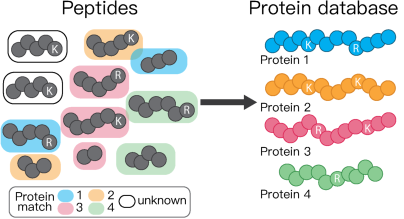

```{r setup, include=FALSE}
library(learnr)
library(tidyverse)
knitr::opts_chunk$set(echo = FALSE)
#knitr::opts_knit$set(root.dir = '../metaproteomics_in_R/')
```


## Tutorial outline
*Caitlin Simopoulos* 


The overall goal for this tutorial is to analyze real metaproteomic microbiome data in R. However, specific goals are:

1.  Understanding how metaproteomic data is acquired 
2.  Complete exploratory data analysis on metaproteomic microbiome data using **PCA**
3.  Complete statistical analysis on metaproteomic microbiome data by **PLS-DA**

By the end of this tutorial you will learn: 

1. How metaproteomic data is acquired (briefly)
2. How to preprocess data
3. A quick quality control check
4. What PCA is and how to complete it in R using `prcomp`
5. How to visualize "big data"


## 1. Understanding metaproteomic data 

Like we talked about in our first week together, our lab studies the gut microbiome using metaproteomics. As computational biologists, it is **essential** to understand where the data comes from in order to analyze it properly. Let's quickly go over how we get our metaproteomic data before we take a dive into data analysis. 

Mass spectrometers are instruments that measure the mass-to-charge ratio (m/z) of a molecule.We can use this information to calculate the exact mass of the molecule, and therefore can identify that molecule from a theoretical database. We also use retention time (how long the molecule took to run through a liquid chromotography column) to identify the molecule. Thus, we use bioinformatics to identify a molecule by matching their "features" to features of known molecules.  

Like the word metaproteomics suggests, we are studying proteins. However, proteins are just too large to be measured by an MS. We first have to cut them enzymatically into smaller peptides. 

```{r digestion, echo = FALSE, out.width = "100%", fig.cap = "Proteins -> peptides."}
knitr::include_graphics("images/digestion.png")
```

Using the MS, we can also measure the **intensity** of a peptide. This is a proxy for abundance. You can think of intensity like it's "gene expression level". The higher the intensity, the more expressed this peptide is and vice versa.

### But peptides aren't proteins!

The problem is that we're not actually interested in peptides, are we? We are interested in entire gene products - proteins. And because we use an enzyme (usually trypsin) to cut up our proteins, we are going to be identifying a lot of peptides that actually belong to multiple proteins. 


Here's a quick example. **Trypsin cuts at K and R.**

```{r protpep, echo = FALSE, out.width = "70%", fig.cap = "Proteins -> peptides."}
knitr::include_graphics("images/prot-to-pep.svg")
```


Check out the peptides outlined in black below. Trypsin cuts them at the exact same position, so we can't match them back to a parent protein.

```{r pepdatabase, echo = FALSE, out.width = "70%", fig.cap = "We can't always match peptides back to a parent protein."}

```

### How MetaLab identifies proteins

We are going to be using the output from [MetaLab](https://www.imetalab.ca) for our analysis.  MetaLab is a metaproteomic pipeline written by the Figeys lab. MetaLab uses another software, [MaxQuant](https://www.nature.com/articles/nprot.2016.136.pdf?origin=ppub) to complete a peptide database search and identify proteins from peptides.

MaxQuant quantifies proteins using "protein groups". Let's say we identified peptides that are found in two different proteins **and** we have **not** identified a peptide that **only** belongs to one of those proteins (a unique peptide).  Those two proteins will be grouped together (into a protein group) and will be quantified together.

Today we will be analyzing protein-group data from a microbiome metaproteomic experiment.

Three samples are **control** samples. These will be labeled PBS1, PBS2, PBS3.

Three samples are treated with **kestose**, a prebiotic. These will be labeled KES1, KES2, KES3.

### Before we start...

Let's discuss our hypotheses. What is FOS? What is a prebiotic? What do you think will happen to a microbiome that is treated with a prebiotic?

## 2. Loading our microbiome data

MetaLab outputs a lot of files for us. Today we're only interested in one file: `proteinGroups.txt`. We're going to learn how in read in a file into R that we've saved on our computer. We can use functions like `read.csv()` and `read.table()`. We're going to use `read.table()` because our file is NOT a CSV. 

Discussion question: *What is a CSV?*


```{r readingdata, exercise=TRUE}
## let's assign data the name "df". 
## this file is pretty big so it might take a couple seconds!

df <- read.table(file="https://caitlinsimopoulos.com/media/proteinGroups.txt", header=TRUE, sep="\t") 
## header=TRUE tells R that the first row contains column names
## sep = "\t" tells R that our file has columns separated with tabs. 

colnames(df)

```
 
Yikes...There is **a lot** of information in this file. Some might say too much for right now....

While all of this information is useful, we are going to focus on protein quantification. We will be using "MaxLFQ" as our quantification method. For the sake of time for this tutorial, we won't be getting into HOW this is calculated, but you can read about it [here](https://www.ncbi.nlm.nih.gov/pmc/articles/PMC4159666/). Briefly, MaxLFQ quantifies protein groups and can be used to describe protein expression. 

We want to use `select()` to grab columns of interest. We're interested in all the columns that **start with** "LFQ.intensity". Good thing there is a function for this: `starts_with`.

We're also introducing the `%>%` pipe. `%>%` can be interpreted as a link from one result to the next. We use it when we want to link multiple functions together in a single line. 
 
```{r readingdatabkp, echo=F}
df <- read.table(file="https://caitlinsimopoulos.com/media/proteinGroups.txt", header=TRUE, sep="\t") 

```
 
 
 
```{r selectdf, exercise=T, exercise.setup="readingdatabkp"}
maxlfq <- df %>% dplyr::select(Protein.IDs, starts_with("LFQ.intensity."))

# here we take df "and then" select colums "Protein.IDs" and columns that 
# "start with" LFQ.intensity.
head(maxlfq)
```

*Hint: use the arrows to scroll to see the other columns*


## 3. Quality control check up

We should probably do a quick quality control check up of our data to make sure there aren't any technical issues (eg. issues introduced by the mass spec). There are a lot of different types of types of quality control we can do, but I chose two that can be visualized using `ggplot2`. In general, we want to make sure that all samples have relatively similar attributes. We expect samples to be more similar than they are different. Today we're going to look at:

1. Protein group intensity distributions across all samples
2. How many missing values there are across all samples.

### Log~2~ abundance boxplots

First we want to look at the mean abundances of proteins across all samples. While we expect that specific protein gene expression will change when the microbiome is treated with kestose, there shouldn't be much difference when we consider all identified proteins. If there is, there may be a technical issue where we are measuring too much or too little of the protein. We can fix this with "normalization", but we have to identify the problem first. 


```{r selectbkp, echo=F}
df <- read.table(file="https://caitlinsimopoulos.com/media/proteinGroups.txt", header=TRUE, sep="\t") 
maxlfq <- df %>% dplyr::select(Protein.IDs, starts_with("LFQ.intensity."))
```

Before we plot the data to make sure everything looks ok, we need to transform the data by log~2~. We log transform data to reduce the contribution that really highly or lowly abundant proteins might have on any statistical analyses we may do. We can choose any base for logging the data, but biologists often choose 2 because it is more "interpretable", but it is really up to the researcher. 

R has a built in command for log~2~: `log2`. We want to log all the columns in our maxlfq data frame other than the Protein.IDs column. We can use `select` to ignore a column. Check out how we'd do this:

```{r log2, exercise=TRUE, exercise.setup="selectbkp"}
log_maxlfq <- maxlfq %>% dplyr::select(-Protein.IDs) %>% log2()
# pay attention to how we can use %>% to link multiple functions together
```

Once we link the data, it's time to plot! Let's think back to our `ggplot` tutorial. We have to tell `ggplot` the `x` and `y` axis...but our data isn't set up like this. We have a lot of columns and we need to plot all at once. In otherwords, we have **wide** data right now, but we need **long** data.

Humans **love** wide data. Just think of how we would set up any table. It makes sense to humans. Computers prefer long data. It's easier to store. I like to use `pivot_longer()` to change my data from wide to long. (Check out [the documentation](https://tidyr.tidyverse.org/reference/pivot_longer.html).) 

*PS You can also use `pivot_wider()` to turn your data frames back into a more human-friendly format!*


```{r longformat, exercise=TRUE, exercise.setup="log2"}
# let's 
colnames(log_maxlfq)
log_maxlfq_long <- log_maxlfq %>% pivot_longer(everything(), names_to="Samples", values_to="log2_MaxLFQ")
```

Once we're in "long format", we can plot our data using the methods we learned last tutorial.

```{r proteinexp, exercise=TRUE, exercise.setup="longformat"}


```

### Missing values

## 4. Exploratory data analysis

**Principal component analysis** (PCA) is another type of quality control that is very common in "-omics" data. Typically we use PCA to visualise data that is very high dimensional (lots of samples and proteins). This way we can identify outlier samples. 

In our case, we will expect that control samples will be similar to each other, and samples treated with kestose will be similar to each other. 