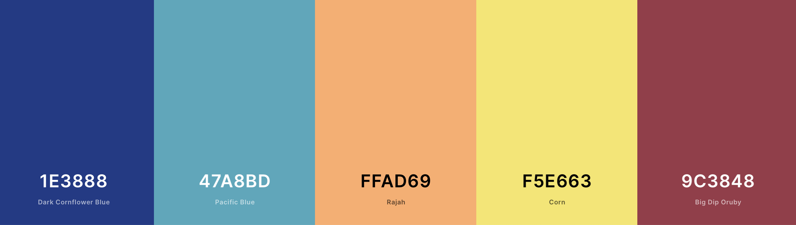

```{r setup, include=FALSE}
library(learnr)
library(tidyverse)
library(palmerpenguins)
knitr::opts_chunk$set(echo = F)
```


## Tutorial outline

The goal for this tutorial is to:

1. Introduce some stats (eg. linear regression, t-test)
2. Learning the benefits of data subsetting
3. Complete different types of data visualization


By the end of this tutorial you will learn how to:

1. Complete and evaluate linear regression
2. Perform t-tests
3. Subset datasets using `{dplyr}`
4. Create plots using `{ggplot2}`:
    - barplot
    - scatterplot 
    - linear regression

## 1. Linear regression intro

Now that we've got the hang of some R functions, let's do some real analysis!

### What is linear regression? 

- explains the linear relationship between dependent (Y) and independent (X) variables 
- "line of best fit" to data
- a "simple" linear regression is equivalent to a *correlation*
- can be considered *supervised* machine learning technique ([see here](http://machinelearningmastery.com/linear-regression-for-machine-learning/))
    - the model learns from known data, and can be used to predict
    - sometimes we are looking for trends and don't care about predictions

linear regression takes the linear equation of:

$$ Y = mX + b $$
But we're going to use it more like:

$$ \hat{y_{i}} = \hat{\beta_{0}} + \hat{\beta_{1}}x_{i} + \epsilon_{i}$$

where:  
$\hat{y_{i}} =$ predicted response for an experimental unit $i$  
$x_{i} =$ predictor (or independent variable) of experimental unit $i$  
$\hat{\beta_{0}} =$ is expected value when $x_{i} = 0$ (intercept)  
$\hat{\beta_{1}} =$ slope  
$\epsilon =$ some error, because models are never perfect!  

[//]: $\hat{\beta_{0}}$ and $\hat{\beta_{1}}$ are unknown


$\beta_{0}$ and $\beta_{1}$ are unknown. We will *estimate these coefficients* from known data.
To do this, we need to estimate a line of best fit than minimizes error... this is where *linear regression* comes in!

## 2. Loading penguin data

We have options for loading data. 

1. We can use `read.csv()` to read in data from a file.  
2. We can use a built-in data set from an R package.

Today we'll use a built in dat set called the [palmerpenguins](https://allisonhorst.github.io/palmerpenguins/index.html) data set. We will use `read.csv()` in the next tutorial.


```{r penguin, echo = FALSE, out.width = "100%", fig.cap = "Artwork by @allison_horst."}
knitr::include_graphics("images/penguins.png")
```


```{r dataloading, exercise=TRUE, cache=T}
# install the package, normally required
# install.packages("palmerpenguins")
# load the package, normally required
#library(palmerpenguins)
# call the data from the package
data(package = 'palmerpenguins') 
# Let's check out what the data looks like
head(penguins)
```

### How to manipulate data

Sometimes we need to access specific data from the data set because we aren't interested in the entire thing. R let's us manipulate data a number of different ways but we'll go over some of the most important ones.

- `data[rows,columns]` 
  - e.g. `data[1:20, c(2,5,6)]` would give us rows 1-20 and columns 2, 5, 6, of "data"
- `data$column_name`
  - e.g. `data$species` would give us the column names "species" in "data"
  
Play around with your `penguins` data set in here with these functions. I'll give you a head start


```{r manip_sandbox, exercise=T, exercise.lines=20}
### Use this space to complete your exercise.
penguins[1:4,c(2:4)]

penguins$island 

## your turn! :)


```


We will focus on two penguin measurements for today:

```{r penguinmeasures, echo = FALSE, out.width = "100%", fig.cap = "Artwork by @allison_horst."}
knitr::include_graphics("images/measurements.png")
```


## 3. Linear regression...with penguins

Ok, let's look at the data to see if a linear model looks reasonable...


### Simple visual check

```{r penguincor, exercise=TRUE}
plot(penguins$bill_length_mm, penguins$bill_depth_mm, 
     main="Bill length vs bill depth", xlab = "Bill length (mm)", ylab = "
     Bill depth (mm)")
```

Hmmm... not sure yet. But! Remember! There are **three** types of penguins in the data. Maybe we'll see some patterns later on...

## 4. Setting up a linear regression

Let's estimate the coefficients we were talking about earlier.

- `lm()` is the linear model function. 
- `formula` and `data` are parameters

Try using this code. What does `summary()` give us? What does `abline()` do?

```{r linearmodel, exercise=TRUE}
lm1 <- lm(formula = bill_length_mm ~ bill_depth_mm, data = penguins)
summary(lm1)
plot(penguins$bill_depth_mm, penguins$bill_length_mm, 
     main="Bill length vs bill depth", xlab = "Bill length (mm)", ylab = "
     Bill depth (mm)")
abline(lm1, col="purple")
```

### Summary output

Our summary output gives us a lot of information:

1. Info about distribution of residuals (errors)
2. The estimates of our coefficients
3. Standard error of coefficient estimates
    - square root of the variance 
      - $\sqrt{\sigma}^{2}$
3. t-values (coefficient estimates/standard error)
3. $R^{2}$ = (want closer to 1)
4. p-values 
    - testing if your coefficient = 0


```{r quizlm}
quiz(
  question("Look back at the summary. Does it seem like our linear model is a good fit to our data?",
    answer("Yes!! Look at the coefficient p-value!"),
    answer("Nope. Check out the line of best fit and the $R^{2}$", correct=T)
  )
)
```


## 5. Complex penguin linear models

OK, so maybe all penguins don't follow the same bill length to depth patterns. How about we test if the type of penguin has an effect on this pattern? We can add this information to our linear model using a different `formula=` parameter, but we have to formulate it on our own. 

We have some options on possible formulas for the linear regression:

* length ~ depth + species 
    * $\hat{length_{i}} = \hat{\beta_{0}} + \hat{\beta_{1}}depth_{i} + \hat{\beta_{2}}species_{i} + \epsilon_{i}$ 
* length ~ depth:species  
    * $\hat{length_{i}} = \hat{\beta_{0}} + \hat{\beta_{2}}species_{i}depth_{i} + \epsilon_{i}$ 
* length ~ depth*species = length ~ depth + species + depth x species 
    * $\hat{length_{i}} = \hat{\beta_{0}} + \hat{\beta_{1}}depth_{i} + \hat{\beta_{2}}species_{i} + \hat{\beta_{2}}species_{i}depth_{i} + \epsilon_{i}$ 

## 6. Your first exercise   
 
OK, so we can run all of these functions, but how do we know what the output is? How can we look at coefficients, error estimate, etc?

Here's your chance to show off! Type how you would print out this information we need and then click on Run Code.

```{r lm_coefficients, exercise=TRUE, exercise_eval=T}
lm2 <- lm(formula = bill_length_mm ~ bill_depth_mm + species, data = penguins)
lm3 <- lm(formula = bill_length_mm ~ bill_depth_mm:species, data = penguins)
lm4 <- lm(formula =bill_length_mm ~ bill_depth_mm*species, data = penguins)
```

```{r lm_coefficients-solution}
lm2 <- lm(formula = bill_length_mm ~ bill_depth_mm + species, data = penguins)
lm3 <- lm(formula = bill_length_mm ~ bill_depth_mm:species, data = penguins)
lm4 <- lm(formula = bill_length_mm ~ bill_depth_mm*species, data = penguins)

summary(lm2)
summary(lm3)
summary(lm4)
```

How can we interpret these linear models? 

*Let's discuss*

## 7. Are all penguins the same?

Before we get into the fun part (data visualization!) , how about we try some more simple stats.

Let's say that we wanted to show a professor that two penguin species differ in mean body weight. We hypothesize that the Chinstrap penguins have a different mean body weight than the Gentoo penguins.

```{r quizstat}
quiz(
  question("What type of statistical test can we do to test hypothesis?",
    answer("Linear model"),
    answer("Student t-test", correct=T),
    answer("ANOVA"),
    answer("We can just look at the means and decide")
  )
)
```


### Finding the mean bodyweight of penguins

We have a pretty big dataset of info on penguins. We don't really need all of it, do we? Right now we're only interested in body weight info of Chinstrap and Gentoo penguins.

We're going to have to subset our data so that we can focus on what we're interested in right now. We are going to be using the function `filter()`. To do this, we're also going to have to learn about "logical operators". 

You will use logical operators often in R programming. Here are some examples:

- `==`: equals
- `!=`: does not equal
- `&`: AND
- `|`: OR
- `>`: greater than
- `>`: less than
- `>=`: greater or equal to
- `<=`: less than or equal to

Note: We're using functions `filter()` and `select()`. These functions are from the [`tidyverse`](https://tidyverse.tidyverse.org) and use special "syntax".  Most `tidyverse` functions **always** consider the first argument as the data, so we don't need explicitly write `data = penguins`. Fun!

Today we want to filter for Chinstrap OR (`|`) Gentoo penguins. It might seem like we're interested in Chinstrap AND (`&`) Gentoo penguins, but in programming logic, that is impossible. **Let's try both and see what happens.**.

```{r filter, exercise=T}
## loading ALL tidyverse packages at once because we'll be using many of them, normaly required
#library(tidyverse)
## filtering for Chinstrap AND Gentoo penguins from the species column of penguins
penguin_chin_gent_AND <-filter(penguins, species == "Chinstrap" & species == "Gentoo")
head(penguin_chin_gent_AND)

## filtering for Chinstrap OR Gentoo penguins from the species column of penguins
penguin_chin_gent_OR <- filter(penguins, species == "Chinstrap" | species == "Gentoo")
# print the first couple rows
head(penguin_chin_gent_OR)
```

Now, we're only interested in the bodyweight of the penguins. We should make an even smaller dataset that only includes the body weight information of Gentoo and Chinstrap penguins. 

```{r test, echo=F}
penguin_chin_gent_OR <- filter(penguins, species == "Chinstrap" | species == "Gentoo")
```

```{r select, exercise=T}
## what are the column names of our dataset again? Let's check
colnames(penguin_chin_gent_OR)

## OK, so body weight is found under column "body_mass_g". Let's select body_mass_g and species so that we
## can calculate the mean body weight of each species.
penguin_chin_gent_bw <- dplyr::select(penguin_chin_gent_OR, species, body_mass_g)
head(penguin_chin_gent_bw)

## what does this function do?
count(penguin_chin_gent_bw, species)
```

Now that we have our dataset, how about we plot some data???


## 8. Intro to `ggplot2`

`ggplot2` is a great package for visualizing all types of data. I think it's more useful to learn how to use `ggplot2` than the "built-in" plotting functions in R that we used briefly in `3. Linear regression...with penguins`. In my opinion, it is more intuitive.... but that's all up for debate. 

We're going to learn how to use ``ggplot2` to plot our penguin data.

```{r ggplot, echo = FALSE, out.width = "100%", fig.cap = "Artwork by @allison_horst."}
knitr::include_graphics("images/ggplot2_masterpiece.png")
```

First we need to initialize a `ggplot`. This tells ggplot which data we'd like to plot and which features we want to plot on the x and y axes. 

```{r bw, echo=F}
penguin_chin_gent_bw <- dplyr::select(penguin_chin_gent_OR, species, body_mass_g)
```

```{r ggplot-intro, exercise=T}
# ggplot2 is already loaded with tidyverse
#library(ggplot2)
ggplot(data=penguin_chin_gent_bw, aes(x=species, y=body_mass_g)) 

```
We haven't told `ggplot()` what *kind* of plot we want. So far, we've just told `ggplot()` that we're ready to plot and which data we want it to use. 

*`ggplot()` uses "geom" layers to plot. "Geoms" are ways to represent your data points, [Here is a nice reference](https://rstudio.com/wp-content/uploads/2015/03/ggplot2-cheatsheet.pdf) for `ggplot()` plotting, but it can be overwhelming at first.*

Some geoms that you might be interested in are:

- `geom_bar()`: Bar plot
- `geom_point()`, `geom_jitter()`: Scatter plots
- `geom_boxplot()`: Boxplot
- `geom_line()`: Line plot
- `geom_line()`: 

Let's try plotting our body weight data as a boxplot.

```{r ggplot-boxplot, exercise=T}
ggplot(data=penguin_chin_gent_bw, aes(x=species, y=body_mass_g)) +
  geom_boxplot()
```

Nice! Looking at the data in this way, do you think these two penguins have a significantly different body mass?

We should test it so that we can give the professor a p-value. Let's use that t-test we discussed before. The t-test function is `t.test()` 

*PS. The Student's t-test was invented by a chemist and statistician named William Sealy Gosset at Guinness in the early 1900s. His boss wouldn't let him use his real name when he published the t-test... and so he published under the pseudonym "Student"!*


```{r penguin-ttest, exercise=T}
## Is body_mass_g influenced by species?
## We can use a similar formula idea as we did for the linear model
ttest_result <- t.test(body_mass_g ~ species, data=penguin_chin_gent_bw)
ttest_result
```

Our prof likes things to look aesthetically pleasing when we give them the penguin info. Let's make our box plot look nice!

First we add `colour=species` into the `aes()` section of the `ggplot()` initialization. In this case, we want the colours of the boxplots to change with the species colours.

**Why do we add `colour=` inside `aes()`?  Everything inside `aes()` is influenced by our actual data. Try moving `colour=species` outside `aes()`. What happens?**

Hint: This would look something like:

```{r penguinhint, eval=FALSE, echo=T}
ggplot(data=penguin_chin_gent_bw, aes(x=species, y=body_mass_g), colour=species) +
  ...
```

```{r penguinBox, exercise=T}
## Let's add some colours to the box plot, and fix the axes labels!

ggplot(data=penguin_chin_gent_bw, aes(x=species, y=body_mass_g, colour=species)) + 
  geom_boxplot() +
  xlab("Species") + # changes the x axis label to anything
  ylab("Body mass (g)") # changes the y axis label to anything
```


Great! Now we know how to do some plots using `ggplot()`. How about we learn how to plot our original linear model data?

## 9. More ggplot2

We originally looked at the relationship of penguin bill length with bill depth. We had plotted the data in a very "simple" way and we didn't really see any patterns. But now we know how to use ggplot to colour plots with info from each species...maybe there's a pattern within each species that we can see?

### Plotting bill length vs depth with ggplot

Let's use a scatter plot to explore our data. Modify this code by updating the `????` to make a scatter plot of penguin bill length by bill depth that has points coloured in by the penguin species.


```{r dots, exercise=TRUE}
ggplot(data=penguins,
           y=????, 
           colour=????)
       ) + 
  geom_????()
```

```{r dots-solution}
ggplot(data=penguins, 
       aes(x=bill_length_mm, 
           y=bill_depth_mm, 
           colour=species)
       ) + 
  geom_point()
```


### Adding our linear model to our plot

Looking at our plot above, there may be some patterns that can be explained by species. We also found this when we completed our linear models. Cool! So, let's add our linear models to our scatter plot. And while we're at it, let's add custom colours to our plots.

Let's go back to our `ggplot2` [cheatsheet](https://rstudio.com/wp-content/uploads/2015/03/ggplot2-cheatsheet.pdf). Under the **Two Variables** section, check out `geom_smooth()`. This geom can calculate a linear model and plot it for us, kind of like the `abline()` we used previously. In this case, we can plot it all at once. Let's try it out!

```{r ggplotpenguin2, exercise=T}
ggplot(data = penguins,
       aes(x = bill_length_mm,
       y = bill_depth_mm,
       colour = species)
       ) +
  geom_point() +
  geom_smooth(method = "lm") # method = "lm" tells ggplot we want to use the linear model function lm()


```

Looks good so far, except for a few things. 

1. `geom_smooth` adds an error estimate from the linear model by default (those grey ribbons around the lines). It's not really helpful for us here, so we should remove that ribbon for now. 
2. We should be more creative with the colours we pick. 
3. Just in case anyone looking at our graph has a hard time telling colours apart, let's also change the points in our plot to shapes that match species. 
4. We should update our axes labels to be more informative. 
5. We keep getting these warnings that tell us we have NAs and that ggplot is removing them... we probably shouldn't ignore these warnings and should investigate.

Let's attack these points one at a time. 


## 10. Perfecting our plot

### 1. Removing error estimate from geom_smooth

To remove these unnecessary ribbons, we need to tell `geom_smooth()` that we don't want them. 

```{r nose, exercise=T}
(no_ribbon <- ggplot(data = penguins,
       aes(x = bill_length_mm,
       y = bill_depth_mm,
       colour = species)
       ) +
  geom_point() +
  geom_smooth(method = "lm", se=FALSE)) #se = FALSE tells ggplot
```


### 2. Updating colours 

One thing I **love** about making plots is making them look fun and pretty. Problem is...I'm not very artistically inclined. I use a lot of different websites for plot color theme inspiration. One of my favourites is [coolors.co](https://coolors.co). It randomly generates complementary colour palettes and I use this all the time. Coolors gives us colours in HEX codes that we can use, or we can type in colours manually (here's a [link to all the colours R understands](http://www.stat.columbia.edu/~tzheng/files/Rcolor.pdf))

Let's make our plot pretty both ways: using HEX codes and the names of colours. We're going to use `scale_colour_manual()` to tell ggplot that we want to manually change the colours.

```{r colourchange, exercise=T}
(new_colours <- ggplot(data = penguins,
       aes(x = bill_length_mm,
       y = bill_depth_mm,
       colour = species)
       ) +
  geom_point() +
  geom_smooth(method = "lm", se=FALSE) + #se = FALSE tells ggplot
  scale_colour_manual(values=c("royalblue", "orange", "limegreen")))
```
I like the blue and orange...but I'm not so sure that the green goes. I'm going to use [coolors.co](https://coolors.co) to help me out!


```{r colourpalette, echo = FALSE, out.width = "100%", fig.cap = "Colour palette by coolors."}

```
I like this palette that coolors suggested. That combination of letters and numbers is the colour's HEX code! We have so many more colour options using these codes. We can input these codes instead of the colour name using the exact same ggplot function.  Feel free to edit these HEX codes as you'd like!

```{r hexchange, exercise=T}
(new_colours <- ggplot(data = penguins,
       aes(x = bill_length_mm,
       y = bill_depth_mm,
       colour = species)
       ) +
  geom_point() +
  geom_smooth(method = "lm", se=FALSE) + #se = FALSE tells ggplot
  scale_colour_manual(values=c("#1E3888", "#FFAD69", "#47A8BD"))) # hex codes start with a "#"
```


### 3. Adding shapes

It's useful to not only change the colours of the points, but also have shapes reflect the data as well. This makes our figures more accessible! We have to add an extra option to `aes()`. In this case, we add `shape = species`.

```{r shapechange, exercise=T}
(new_colours <- ggplot(data = penguins,
       aes(x = bill_length_mm,
       y = bill_depth_mm,
       colour = species,
       shape = sex, 
       group = species) 
       ) +
  geom_point() +
  geom_smooth(method = "lm", se=FALSE)) + #se = FALSE tells ggplot
  scale_colour_manual(values=c("#1E3888", "#FFAD69", "#47A8BD")) # hex codes start with a "#"
```

However, what if we're interested in adding more information to our plot? What about if we wanted to look at how the penguin's sex is reflected in these bill measurements? We would tell ggplot to change either the colour or the shape  from `species` to `sex`. Try it out in the above plot. What happens?

Yikes.I bet something didn't look so right when we added that extra grouping. That's because our original `ggplot(data = penguins,aes(x = bill_length_mm, y = bill_depth_mm,colour = species,shape = sex)` call told ggplot to use of that information for the rest of the plot. Our linear model is now trying to add information for both sex and species, making it a little fuzzy. We can force ggplot to group any statistical functions by species while allowing us to colour/shape the rest of the data how we want. To do this, we add `group = species` to our `aes()` function.  (*This may be useful for your mini-homework*)

```{r forcegroup, exercise=T}
(new_colours <- ggplot(data = penguins,
       aes(x = bill_length_mm,
       y = bill_depth_mm,
       colour = sex,
       shape = species, 
       group = species) 
       ) +
  geom_point() +
  geom_smooth(method = "lm", se=FALSE)) + #se = FALSE tells ggplot
  scale_colour_manual(values=c("#1E3888", "#FFAD69", "#47A8BD")) # hex codes start with a "#"
```

Now we can see how ignoring those warnings is coming back to haunt us... What do you think is happening here? Let's discuss

### 4. Changing axes labels

We're already learned how to do this **hint `xlab()` might ring a bell...**.
I'll leave it up to you to rename our axes to appropriate names. 

```{r axes, exercise=T}
(axes <- ggplot(data = penguins,
       aes(x = bill_length_mm,
       y = bill_depth_mm,
       colour = species,
       shape = sex, 
       group = species) 
       ) +
  geom_point() +
  geom_smooth(method = "lm", se=FALSE) + #se = FALSE tells ggplot
  scale_colour_manual(values=c("#1E3888", "#FFAD69", "#47A8BD"))) # hex codes start with a "#"
```


### 5. Dealing with warnings 

Back to those warnings...  ggplot is telling us that our dataset is incomplete and contains `NA`s. Researchers use `NA`s when recording data if they were unable to take the measurement, or the measurement is missing for some reason. Keeping these `NA`s is not always helpfor for us. Thankfully we have a function that can help us remove any rows (observations) with `NA`s. This function is `complete_cases()`.

```{r completecases, exercise=T}
penguins_removeNA <- drop_na(penguins)
(axes <- ggplot(data = penguins_removeNA,
       aes(x = bill_length_mm,
       y = bill_depth_mm,
       colour = species,
       shape = sex, 
       group = species) 
       ) +
  geom_point() +
  geom_smooth(method = "lm", se=FALSE) + #se = FALSE tells ggplot
  scale_colour_manual(values=c("#1E3888", "#FFAD69", "#47A8BD"))) # hex codes start with a "#"
```
Yay! We've removed our warnings! 

### 6. Our final plot!

Here's an example of a final plot that went a bit further than what we did in our steps above. 

What has been added to this plot? If you change some options around, what happens? You might want to use some of these options for your "homework".


```{r removeNA, echo=F}
penguins_removeNA <- drop_na(penguins)
```

```{r finalplot, exercise=T}

(final <- ggplot(data = penguins_removeNA,
       aes(x = bill_length_mm,
       y = bill_depth_mm,
       colour = species,
       shape = species, 
       group = species)) +
  geom_point(size = 3, alpha = 0.8) +
  geom_smooth(method = "lm", se=FALSE) + #se = FALSE tells ggplot
  scale_colour_manual(values=c("#1E3888", "#FFAD69", "#47A8BD")) + # hex codes start with a "#"
 labs(x = "Bill length (mm)",
       y = "Bill depth (mm)",
       color = "Penguin species",
       shape = "Penguin species")+
   theme_bw())
```


## Your homework 

Now that we've learned how to:

1. Filter data
2. Select relevant columns
3. Test our hypotheses
4. Visualize our data

**It's time for you to complete some of this on your own!**

Your task:
Come up with your own hypothesis using the penguin dataset and write it out. Choose a statistical test (*hint: it can be one we used already*). Complete your statistical test. Visualize your data using `ggplot2`. 

Some ideas to get you started:
  - Does an island have an influence on penguin species? For example, do Adelie penguins that live on different islands vary in some sort of measurement? 
  - Does the sex of a penguin influence a measurement? 

```{r testing-stats, exercise=T, exercise.lines=20}
### Use this space to complete your exercise.


```

Once you're done, save your code, or take a screenshot of the code and your plot. You can show it off to all of us! 